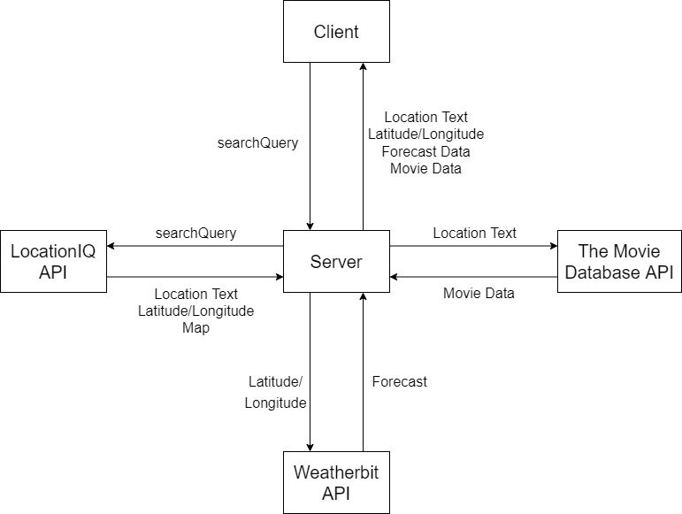

# Project Name

**Author**: Your Name Goes Here
**Version**: 1.0.0 (increment the patch/fix version number if you make more commits past your first submission)

## Overview
<!-- Provide a high level overview of what this application is and why you are building it, beyond the fact that it's an assignment for this class. (i.e. What's your problem domain?) -->

## Getting Started
<!-- What are the steps that a user must take in order to build this app on their own machine and get it running? -->

## Architecture
<!-- Provide a detailed description of the application design. What technologies (languages, libraries, etc) you're using, and any other relevant design information. -->

## Change Log

|Set up your React repository & API keys||
|---|---|
|Estimate of time needed to complete|45 minutes|
|Start time|1:30 PM|
|Finish time|2:23 PM|
|Actual time needed to complete|53 minutes|

|Retrieve latitude and longitude||
|---|---|
|Estimate of time needed to complete|1 hour|
|Start time|2:30 PM|
|Finish time|4:45 PM|
|Actual time needed to complete|2 hours, 15 minutes|

|Retrieve map, improve CSS||
|---|---|
|Estimate of time needed to complete|1.5 hour|
|Start time|4:45 PM|
|Finish time|9:40 PM|
|Actual time needed to complete|1 hours, 25 minutes|

|Error message||
|---|---|
|Estimate of time needed to complete|30 minutes|
|Start time|9:40 PM|
|Finish time|10:15 PM|
|Actual time needed to complete|35 minutes|

|Weather info live||
|---|---|
|Estimate of time needed to complete|45 minutes|
|Start time|6:00 PM|
|Finish time|8:45 PM|
|Actual time needed to complete|2 hours 45 minutes|

## Credit and Collaborations
<!-- Give credit (and a link) to other people or resources that helped you build this application. -->